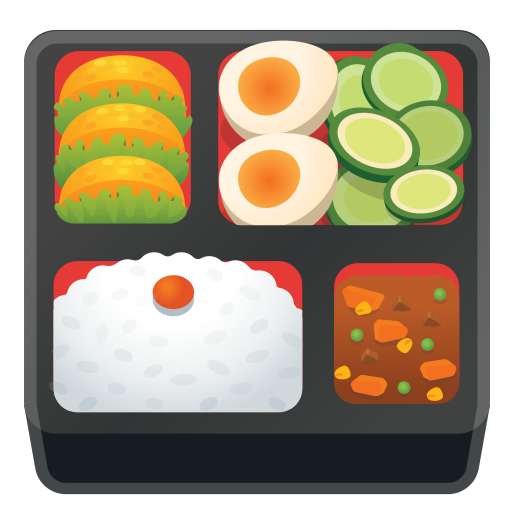
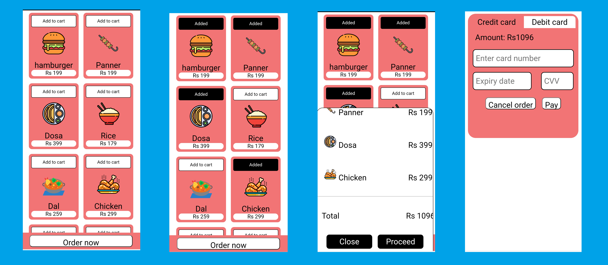

#  Food App UI

This app will run on smartphones and tablets.



## Installing and setting up Apache Cordova

First goto folder by running following command:

```
cd food-app-ui
```

Before installing and running anything related to Cordova, you will need to install the SDK for each platform that you intend to build your application for. In this post we will focus on iOS and Android; nevertheless, the process for other platforms is quite similar.

You will need a Mac computer with Xcode to specify iOS as the target platform, and the Android SDK to target the Android platform.

For instructions on downloading and configuring the Android SDK, go to the Official Android SDK installation documentation.

First, install the Cordova command-line utility by running the following command:
```
npm install -g cordova
```
If you are on a Mac computer, you must add sudo at the start of the aforementioned command.

Create a new Cordova project by running the following command, where [your-app-name] is the folder where the app will be created:
```
cordova create your-app-name com.example.myapp MyAppName
```
The create command has three parameters: the first specifies the folder where the solution will be created, the second is a reverse domain-style identifier which must be unique, and the last one is the application display name. The last two paramenters can be omitted and configured later in the config.xml file.

Browse to the project folder to add the platforms that you want to support. To do this, once you are in the project foler, run the following command for each platform you want to add:
```
cordova platform add [platform]
```
Where [platform] can be:

ios

android

windows

wp8

blackberry10

firefoxos

amazon-fireos

If you want to check which platforms are available in your system, run cordova platform ls.

Each time you run the platform add command, it will add native files to build apps for the specified platform. After running the above command, you should find a folder named ios containing .xcodeproj files and a bunch of other files.

Now, create apk file using this command
```
cordova build [platform]
```

## Execution

### For andriod
1) Download the andriod app from -> [link](https://github.com/abhineetraj1/food-app-cordova/raw/main/Food%20app_1_1.0.apk)
2) Install the downloaded apk.

## Languages used:-
<p align="left"> <a href="https://cordova.apache.org/" target="_blank" rel="noreferrer">  </a> <a href="https://www.w3schools.com/css/" target="_blank" rel="noreferrer">  </a> <a href="https://www.w3.org/html/" target="_blank" rel="noreferrer">  </a> <a href="https://developer.mozilla.org/en-US/docs/Web/JavaScript" target="_blank" rel="noreferrer">  </a> </p>

## Authors
- [@abhineetraj1](https://www.github.com/abhineetraj1)
